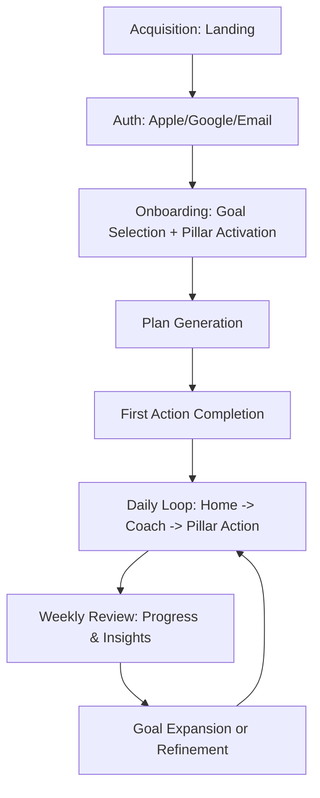
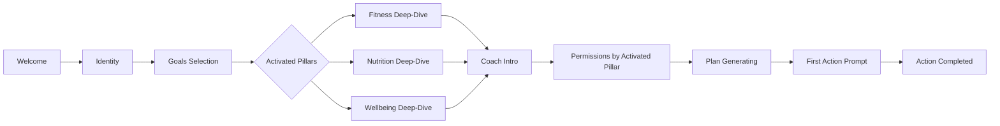
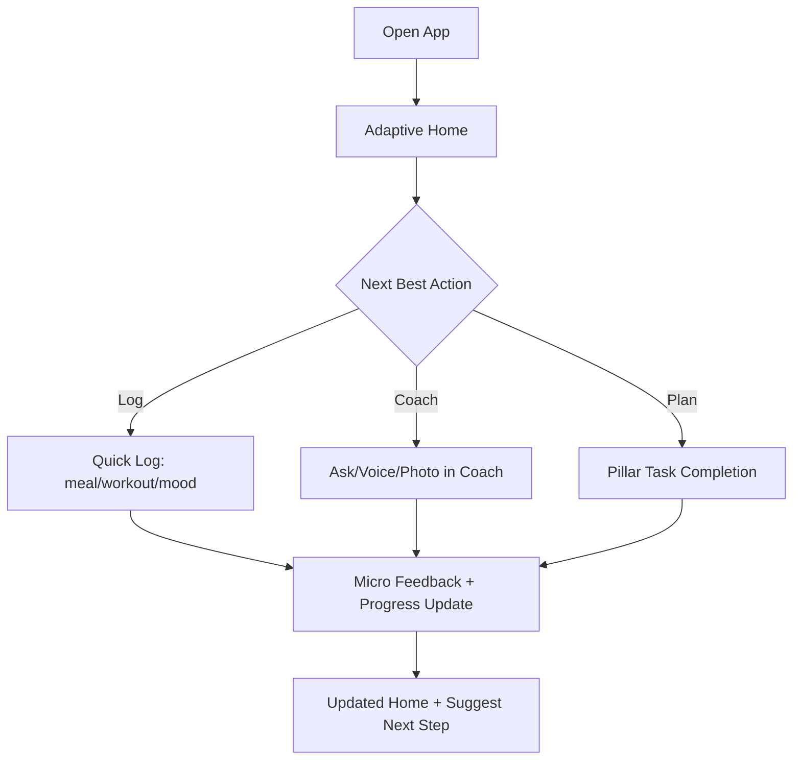

# Balencia UX Flow Architecture

This file is the UX flow source-of-truth for Balencia.

---

## 1) Primary User Flow Stack

---

## 2) Day-0 Activation Flow (Critical)

**Purpose:** user must complete at least one meaningful action in session 1.

---

## 3) Daily Engagement Flow

---

## 4) Canonical Navigation & Surface Rules

- Keep top-level navigation constrained: `Home`, pillar surfaces, `Coach`, `Profile`.
- Respect adaptive surface area: do not show inactive pillars in primary UI.
- AI Coach remains a primary path, not a buried secondary feature.
- Each screen should expose one clear primary action.

---

## 5) User Architecture (Intent -> Surface -> Success)

| User Intent | Entry Surface | Primary Journey | Success Signal |
|---|---|---|---|
| I need quick daily guidance | Home + Coach card | One-tap action -> completion -> next suggestion | 3+ actions/week |
| I want to track a pillar deeply | Pillar screen | Plan -> execute -> log -> review trend | Week-over-week improvement |
| I need understanding, not just data | Coach | Ask -> explain -> recommendation -> action | Coach recommendation followed |
| I want progress clarity | Progress screen | Weekly narrative -> compare -> adjust goal | Weekly review completion |
| I want to change goals | Profile -> Goals | Add/remove goal -> deep-dive -> adapt home | New goal activated without churn |

---

## 6) Core UX Event Architecture (Tracking)

Track these as first-class events:

- `onboarding_started`
- `goals_selected`
- `pillars_activated`
- `onboarding_completed`
- `first_action_prompt_shown`
- `first_action_completed`
- `coach_interaction_started`
- `coach_to_action_converted`
- `daily_checkin_completed`
- `weekly_review_opened`
- `goal_refined`

Use these events to evaluate UX quality, not just page views.

---

## 7) UX Implementation Checklist (Sprint Use)

### Sprint Readiness

- [ ] Single sprint UX goal defined
- [ ] Primary user intent selected
- [ ] In-scope flow locked
- [ ] Metrics locked (1 primary + 2 guardrails)
- [ ] Accessibility criteria attached
- [ ] State coverage defined (loading, empty, offline, stale, error, recovery)

### Design/Build Quality

- [ ] One primary action per screen
- [ ] Adaptive surface area respected
- [ ] Coach-first path available for high-friction flows
- [ ] Microcopy is supportive and non-shaming
- [ ] Permission prompts include contextual rationale
- [ ] First-session action requires minimal taps

### QA/Analytics

- [ ] Event instrumentation verified
- [ ] Cross-device QA complete
- [ ] Accessibility QA complete
- [ ] Offline/degraded states validated
- [ ] KPI readout completed before sprint close
