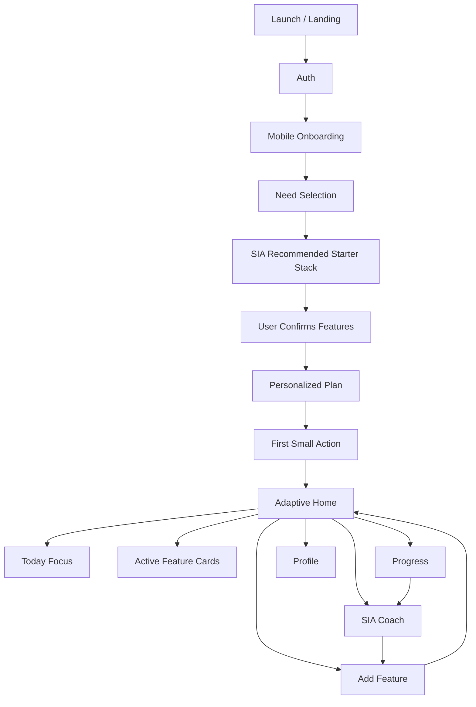
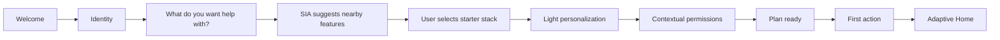
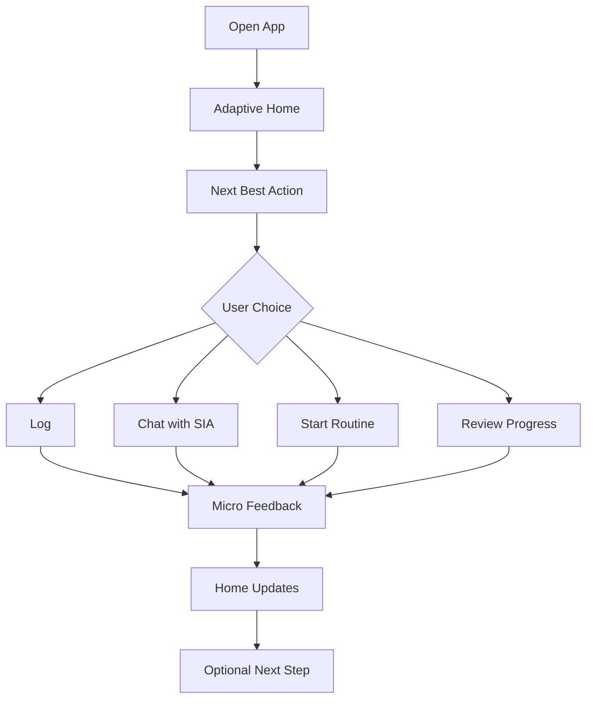

# Balencia — Mobile UX Architecture 2.0

**Product:** Balencia Mobile App  
**AI Coach:** SIA  
**UX Direction:** Need-led, coach-first, mobile-first, feature-adaptive  
**Major Change:** Remove the fixed three-pillar structure. Balencia should no longer expose Fitness / Nutrition / Wellbeing as the core user-facing architecture. The app should adapt around what the user asks for, selects, reports, and needs over time.

---

## 1. Executive Summary

Balencia should feel like a personal wellness companion that reshapes itself around the user. Instead of asking users to understand product categories, Balencia should ask what they need help with and then let **SIA AI Coach** recommend the closest useful features.

The new architecture is:

```text
User Need → SIA Recommendation → Starter Feature Stack → First Action → Adaptive Home → Daily Support → Weekly Review → Add / Refine Features
```

This means a user can start with something simple like **Sleep Better**. SIA then suggests nearby support features such as sleep check-ins, wind-down routines, stress check-ins, breathing sessions, and evening reminders. The user selects the features they want using chips or cards. Later, SIA can suggest more features based on usage, reports, and progress.

The goal is to make Balencia easier, more personal, and more convenient on mobile.

---

## 2. What Changes From the Previous UX

### Previous UX
- Balencia was organized around three user-facing pillars.
- Features were grouped under Fitness, Nutrition, and Wellbeing.
- Onboarding activated pillars based on goals.
- Navigation and home content were driven by `activatedPillars`.

### New UX
- Balencia is organized around **user needs**, not fixed pillars.
- Users select what they want help with using chips or cards.
- SIA recommends the nearest helpful features.
- Users activate a personalized feature stack.
- Features can be added or removed later.
- SIA can suggest new features after days or weeks based on user reports, behavior, and progress.

### Product Principle
Balencia should not say:  
> “Choose your pillar.”

Balencia should say:  
> “What do you want help with today?”

---

## 3. Core UX Principles

### 3.1 Need-First, Not Pillar-First
Users should never need to understand internal product structure. They should only see the support areas that match their needs.

### 3.2 SIA Is the Product Engine
SIA is not only a chat screen. SIA should power:
- onboarding guidance,
- feature recommendations,
- daily coaching,
- proactive nudges,
- progress summaries,
- feature discovery,
- and ongoing plan refinement.

### 3.3 Mobile-First Simplicity
The app should be designed for quick mobile sessions:
- large tap targets,
- chips and cards,
- short flows,
- minimal typing,
- voice/photo input where helpful,
- one clear next action per screen.

### 3.4 Progressive Feature Activation
Do not show everything at once. Activate only the tools the user wants or SIA recommends as useful now.

### 3.5 User Control
SIA can recommend, but the user decides what to add, skip, snooze, or remove.

### 3.6 One Clear Next Step
Every major screen should answer: **What should I do next?**

### 3.7 The App Grows With the User
Balencia should expand after onboarding through AI suggestions, manual feature adding, weekly recaps, and behavior-based nudges.

---

## 4. New Product Architecture

Balencia becomes a dynamic wellness system made of four layers.

### Layer 1 — User Need Layer
The user starts by selecting needs or asking SIA for help.

Example needs:
- Sleep better
- Reduce stress
- Improve energy
- Eat healthier
- Track meals
- Drink more water
- Build a routine
- Move more
- Lose weight
- Build strength
- Improve focus
- Recover better
- Manage mood
- Stay consistent

### Layer 2 — SIA Recommendation Layer
SIA interprets the selected need and recommends nearby helpful features.

Example:

```text
User selects: Sleep Better
SIA recommends: Sleep Check-in, Evening Wind-down, Bedtime Reminder, Stress Check-in, Breathing Break
```

### Layer 3 — Activated Feature Stack
The app activates only the selected tools.

Possible feature modules:
- Sleep check-ins
- Bedtime routine
- Wind-down reminders
- Mood check-ins
- Stress pulse
- Breathing exercises
- Meal log
- Hydration tracker
- Activity log
- Workout plan
- Recovery check-in
- Energy review
- Habit builder
- Reflection journal
- Focus session
- Progress recap

### Layer 4 — Expansion Layer
After the user has used the app for a few days or weeks, SIA can suggest new features.

Example:
> “You often report low energy in the afternoon. Would you like to add hydration tracking and a quick lunch quality check?”

---

## 5. Mobile Information Architecture



### Recommended Bottom Navigation
Use a stable four-tab mobile navigation:

1. **Home** — adaptive dashboard and today focus
2. **SIA** — AI chat, voice/photo input, recommendations, support
3. **Progress** — weekly recap, trends, milestones, insights
4. **Profile** — goals, active features, personalization, privacy, integrations

### Supporting Entry Points
- **Quick Log FAB** on Home
- **Add Feature** card on Home
- **SIA suggestion pop-ups** inside chat
- **Feature suggestions** in Weekly Recap
- **Manage Features** inside Profile

### Navigation Rule
Do not create a tab for every feature. New features should appear as cards, modules, or quick actions inside the adaptive app shell.

---

## 6. New Onboarding Flow

The onboarding should be conversational, fast, and mobile-friendly.

### Total Time Target
- Ideal path: under 2 minutes
- Extended path: under 4 minutes

### Onboarding Flow

```text
Welcome → Identity → Need Selection → SIA Suggests Nearby Features → Select Starter Stack → Optional Personalization → Permissions → Plan Ready → First Action → Home
```

---

## 7. Day-0 Activation Flow



### Step 1 — Welcome
Purpose: explain the product in one sentence.

Suggested copy:
> “Balencia adapts to what you need most. SIA will help you choose where to start.”

Primary CTA:
> Get Started

### Step 2 — Identity
Ask only for basic identity.

Fields:
- Name
- Optional age or basic profile details

Do not slow the user down with long forms.

### Step 3 — Need Selection
This replaces the old pillar activation screen.

UI pattern:
- Large chips or cards
- Multi-select
- Friendly icons
- Minimum one selection
- Recommended one to three selections

Suggested cards:
- Sleep better
- Reduce stress
- Improve energy
- Eat healthier
- Track meals
- Build a routine
- Move more
- Lose weight
- Strength & fitness
- Improve focus
- Track my progress
- Feel more balanced

### Step 4 — SIA Suggests Nearby Features
SIA responds immediately after the user selects a need.

Example:

User selects:
- Sleep better

SIA says:
> “Sleep is a great place to start. I recommend Sleep Check-ins, Bedtime Reminder, Evening Wind-down, and a short Stress Check-in because these usually work together.”

### Step 5 — Select Starter Stack
Users select the exact features they want to activate now.

Example feature cards:
- Sleep Check-ins
- Bedtime Reminder
- Evening Wind-down
- Stress Check-in
- Breathing Break

Each card should include:
- feature name,
- one-line benefit,
- selected / unselected state,
- optional “Why this?” link.

### Step 6 — Optional Personalization
Ask only what is needed for the selected stack.

If user selected sleep features:
- usual bedtime,
- usual wake time,
- reminder preference,
- biggest sleep challenge.

If user selected meal features:
- diet preference,
- allergies,
- meal logging preference: photo, voice, or search.

If user selected activity features:
- current activity level,
- preferred place: home, gym, outdoor,
- limitations or injuries.

### Step 7 — Contextual Permissions
Ask for permissions only when relevant.

Examples:
- Notifications for reminders
- Camera for photo logging
- Microphone for voice logging
- Health/device sync for activity or sleep

Each permission should have a pre-permission explanation.

### Step 8 — Plan Ready
SIA summarizes the activated starter stack.

Example:
> “Your first plan is ready: Sleep Check-ins, Evening Wind-down, Bedtime Reminder, and Weekly Sleep Review. Let’s start with one quick check-in.”

### Step 9 — First Action
The user should complete one small action in the first session.

Examples:
- Log last night’s sleep
- Set bedtime reminder
- Start a 1-minute breathing session
- Tell SIA the biggest challenge
- Complete a quick mood check-in

---

## 8. Adaptive Home

Home should be the daily command center. It should not show irrelevant sections.

### Home Layout
1. Greeting and streak / status
2. SIA Coach Card
3. Today Focus
4. Active Feature Cards
5. Quick Actions
6. Insight Card
7. Add Feature Card

### Home Example: Sleep-Focused User
If the user selected sleep and stress support, Home may show:
- SIA Coach Card: “Tonight, protect your wind-down routine.”
- Today Focus: “Start wind-down at 10:15 PM.”
- Sleep Check-in card
- Stress Pulse card
- Breathing Break card
- Weekly Sleep Insight
- Add Feature: “SIA suggests Morning Energy Review.”

### Home Rule
No irrelevant content. If the user has not activated meal tracking, workouts, or hydration, those modules should not appear unless SIA recommends them with context or the user manually adds them.

---

## 9. SIA Coach Module

SIA should be the most important experience in Balencia.

### SIA Input Types
- Text
- Voice
- Photo
- Quick-reply chips
- Action cards
- Suggested follow-ups

### What SIA Can Do
- Ask questions during onboarding
- Recommend starter features
- Explain why a feature is useful
- Help users log information
- Give daily next-best actions
- Summarize weekly progress
- Suggest new features after usage patterns appear
- Help users refine goals
- Remember preferences and past context

### SIA Recommendation Pop-Ups
SIA can suggest new features inside the chat module using small pop-out cards.

Example:
> “You’ve logged poor sleep three times this week. Want to add a 2-minute Evening Reflection to help identify what’s affecting it?”

Actions:
- Add Feature
- Tell me more
- Not now

### Recommendation Timing
SIA should suggest features:
- after a few days of usage,
- during weekly recaps,
- when the user reports repeated problems,
- when progress stalls,
- when a related feature can support the active goal,
- when the user asks for help.

### Tone Rules
SIA should be:
- helpful,
- non-judgmental,
- clear,
- calm,
- specific,
- never pushy.

---

## 10. Add Feature Flow

Users should be able to add apps/features after using Balencia.

### Entry Points
- Home Add Feature card
- SIA recommendation pop-up
- SIA chat response
- Weekly Recap suggestion
- Profile → Active Features

### Manual Add Flow

```text
Open Add Feature → See Recommended For You → Browse Feature Cards → Tap Add → Quick Setup → Feature Appears on Home
```

### SIA-Led Add Flow

```text
Usage Signal → SIA Suggests Feature → User Accepts → Quick Setup → Home Updates → SIA Supports New Feature
```

### Feature Card Content
Each feature card should show:
- feature name,
- short benefit,
- why SIA recommends it,
- estimated effort,
- Add button.

Example:

**Morning Energy Review**  
“Track how rested you feel after sleep.”  
Recommended because: “You’re working on sleep consistency.”  
Effort: 15 seconds/day  
CTA: Add to My App

---

## 11. Daily Engagement Flow



### Daily Loop

```text
Open App → See Today Focus → Complete small action → Receive feedback → Home updates → Continue or exit
```

### Daily UX Goal
The user should feel that Balencia made the next step obvious and easy.

---

## 12. Progress & Insights

Progress should feel like a coach recap, not a complicated analytics dashboard.

### Progress Screen Sections
- Weekly summary
- Monthly view
- Goal movement
- Streaks and consistency
- SIA narrative summary
- Best improvements
- Patterns found
- Suggested next feature or refinement

### Example Weekly Summary
> “This week, you completed 5 evening routines and slept 42 minutes longer on average. Your stress check-ins were lower on days when you used breathing breaks. SIA suggests adding Morning Energy Review to understand how sleep affects your day.”

---

## 13. Profile & Settings

Profile should support control and trust.

### Profile Areas
- Personal details
- Current needs
- Active features
- Add / remove features
- Coach personality and tone
- Coach memory controls
- Notification preferences
- Privacy and data controls
- Connected apps and devices

### User Controls
Users should be able to:
- change needs,
- add new features,
- remove features,
- pause SIA recommendations,
- adjust reminder frequency,
- clear SIA memory,
- see what SIA remembers,
- manage connected devices.

---

## 14. Retention Mechanics

Retention should be based on relevance and momentum, not guilt.

### Core Mechanics
- Streaks
- Weekly recap
- Milestone moments
- Re-engagement check-ins
- Small wins
- Surprise insights
- Adaptive feature suggestions
- SIA memory continuity

### Good Re-Engagement Copy
> “Been a few days. Want me to simplify your plan for this week?”

### Bad Re-Engagement Copy
> “You failed your routine.”

---

## 15. Recommendation Logic

SIA should recommend features based on signals.

### Signal Types
- selected needs,
- repeated user reports,
- missed actions,
- completed streaks,
- low energy logs,
- sleep inconsistency,
- stress trends,
- meal inconsistency,
- user questions,
- device data,
- weekly progress patterns.

### Example Rules

| Signal | Possible SIA Suggestion |
|---|---|
| User selects Sleep Better | Sleep Check-ins, Bedtime Reminder, Evening Wind-down |
| User reports stress often | Stress Pulse, Breathing Break, Reflection Journal |
| User logs low energy repeatedly | Hydration Tracker, Morning Energy Review, Sleep Review |
| User asks about food | Meal Log, Meal Plan, Photo Food Logging |
| User misses routine often | Simpler routine, fewer reminders, consistency plan |
| User completes 7 days | Milestone + next supportive feature |

---

## 16. Analytics Event Architecture

Track these events:

- `onboarding_started`
- `need_selected`
- `cia_recommendation_shown`
- `starter_feature_selected`
- `starter_stack_confirmed`
- `personalization_completed`
- `permission_requested`
- `first_action_prompt_shown`
- `first_action_completed`
- `home_opened`
- `today_focus_viewed`
- `quick_action_used`
- `cia_chat_opened`
- `cia_message_sent`
- `cia_feature_suggestion_shown`
- `cia_feature_suggestion_accepted`
- `cia_feature_suggestion_dismissed`
- `feature_added`
- `feature_removed`
- `weekly_recap_opened`
- `goal_refined`

### Key Success Metrics
- Onboarding completion rate
- First action completion rate
- Day-1 retention
- Day-7 retention
- SIA suggestion acceptance rate
- Feature adoption rate
- Weekly recap open rate
- Active feature usage frequency

---

## 17. Delivery Roadmap

### Phase 1 — Mobile Foundation
- New onboarding flow
- Need selection chips/cards
- SIA starter recommendations
- Starter stack confirmation
- Adaptive Home
- SIA chat MVP
- First action completion flow

### Phase 2 — Feature Expansion System
- Add Feature screen
- SIA pop-out recommendations
- Feature management in Profile
- Weekly recap recommendations
- Recommendation event tracking

### Phase 3 — Smarter Personalization
- Behavior-based suggestions
- Deeper SIA memory
- Device integrations
- Personalized nudges
- More advanced progress narratives

### Phase 4 — Advanced Intelligence
- Prediction-based next-best actions
- Multi-week plan adaptation
- Feature bundles based on user behavior
- Re-engagement automation
- Deeper trend comparisons

---

## 18. UX Anti-Patterns to Avoid

Do not:
- expose the old three-pillar structure,
- overload the bottom navigation,
- show all features at once,
- force long onboarding forms,
- recommend features without explaining why,
- use shame-based copy,
- make AI feel like a side feature,
- create “locked feature” clutter,
- force users to restart onboarding to add features,
- show irrelevant modules on Home.

---

## 19. Sprint UX Checklist

Before shipping, confirm:

- Is the flow mobile-first?
- Is the next action obvious?
- Are chips/cards used where possible?
- Did we avoid fixed pillar language?
- Does SIA have a real role in the flow?
- Are irrelevant features hidden?
- Can users add or remove features later?
- Is SIA’s suggestion contextual and useful?
- Is the feature tied to a real user need?
- Is privacy and memory control clear?
- Are events tracked correctly?

---

## 20. Final Product Definition

Balencia is a **mobile AI-guided adaptive wellness app**.

Users begin with what they need help with. SIA recommends the nearest useful features. The user activates a starter stack. The app becomes simple and personal on day one. Over time, Balencia expands through user choice and SIA’s intelligent suggestions.

### Positioning Statement

**Balencia adapts to you.**  
Start with the support you need now, and let SIA guide you toward the next features, habits, and actions that help you feel better over time.
