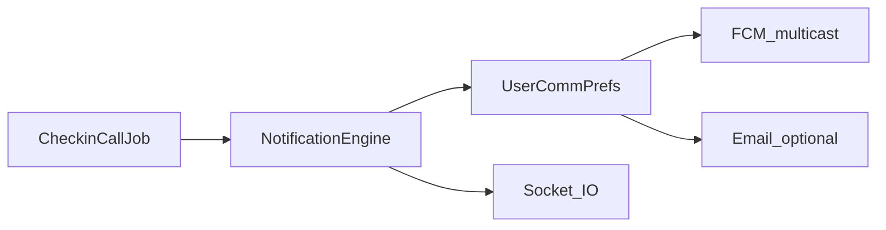

# yHealth — System Design & Business Logic

> **Last updated**: 2026-04-17 | **Version**: 2.0 | **Owner**: Salman

---

## 1. North Star Architecture

> "yHealth is a life coach, not a health app."
> — Hamza (Founder), Feature Review 2026-04-07

### The reframe

Health pillars (fitness, nutrition, well-being) are **sensors, not features**. They exist because the AI needs quantifiable data to understand users. The product is the **AI Coach** — everything else feeds it.

```
┌─────────────────────────────────────────────────────────┐
│                    USER INTERFACE                        │
│  Dashboard · Voice Assistant · Chat · Notifications     │
├─────────────────────────────────────────────────────────┤
│                  AI COACH ENGINE                         │
│  Proactive Messaging · Obstacle Diagnosis ·              │
│  Goal Reconnection · Crisis Detection ·                  │
│  Personality Modes · Accountability                      │
├──────────┬──────────┬──────────┬────────────────────────┤
│ FITNESS  │NUTRITION │WELLBEING │ UNIVERSAL LIFE AREAS    │
│ Workouts │ Meals    │ Mood     │ Career · Relationships  │
│ Activity │ Calories │ Stress   │ Finance · Creativity    │
│ Streaks  │ Diet     │ Sleep    │ Prayer · Education      │
├──────────┴──────────┴──────────┴────────────────────────┤
│              DATA CORRELATION ENGINE                     │
│  Cross-Pillar Intelligence · Calendar · Spotify ·        │
│  WHOOP · Daily Scoring                                   │
├─────────────────────────────────────────────────────────┤
│              INFRASTRUCTURE                              │
│  PostgreSQL · Socket.IO · Multi-Provider LLM ·           │
│  26 Background Jobs · Express API                        │
└─────────────────────────────────────────────────────────┘
```

### Principle mapping

| Founder Principle | Technical Implementation |
|---|---|
| "It's a life coach" | `life_goals` table covers ALL categories: spiritual, social, career, creative, financial, relationships, education, personal_growth. `life-areas.service.ts` routes intents to domain-specific coaching. |
| "Pillars are sensors" | `cross-pillar-intelligence.service.ts` runs 22 contradiction rules across 6 domains. Pillar data feeds the scoring/analysis pipeline, not the UI directly. |
| "Sustain motivation & accountability" | 40+ proactive message types scored every 3 hours. Accountability contracts with financial stakes. Buddy matching. Social accountability with consent. |
| "Universal scope — 'Can yHealth help me with X?' → always yes" | `life_areas` + `life_area_links`; `life-area-intent-router.service.ts` classifies chat; **`ToolTurnContext`** threads `activeLifeAreaId` into `createSemanticTools` so `scheduleManager` / `goalManager` writes auto-link to the active area. `GET /life-areas/summary` + `listLinksResolved` power hub UI. |

---

## 2. System Overview

### Stack

| Layer | Technology |
|---|---|
| Client | Next.js 16 (Turbopack), React 19, TypeScript, Tailwind CSS, Framer Motion |
| Server | Express.js (Node.js), TypeScript, Socket.IO |
| Database | PostgreSQL (127+ tables, raw SQL migrations) |
| AI | Multi-provider: Gemini (primary), DeepSeek (fallback), OpenAI (fallback) via `ai-provider.service.ts` |
| Real-time | Socket.IO for chat, notifications, proactive messages, voice signaling |
| Voice | WebRTC signaling, ElevenLabs TTS, AssemblyAI STT |
| Integrations | Google Calendar (OAuth2), WHOOP, Spotify, WhatsApp |
| Background | 27+ interval-based jobs with staggered boot delays |

### Server boot sequence

```
0s    ─ Express + Socket.IO listen
0s    ─ reminder-processor (60s interval)
0s    ─ workout-audit, nutrition-analysis, schedule-automation
30s   ─ proactive-messaging (3h interval) ← CORE ENGINE
90s   ─ daily-analysis (2h interval)
240s  ─ whoop-sync (1h)
300s  ─ coach-profile-generation (6h)
360s  ─ insights-computation (6h)
420s  ─ life-history-digest
540s  ─ email-digest (6h)
600s  ─ streak-validation (1h), engagement-scoring (7d)
660s  ─ status-followup
720s  ─ status-pattern-analysis
780s  ─ accountability-trigger
840s  ─ contract-evaluation (2h)
900s  ─ micro-wins (6h)
960s  ─ buddy-suggestion (7d)
990s  ─ checkin-call (proactive voice check-ins; keyset user scan)
1020s ─ calendar-sync (1h)
1080s ─ obstacle-detector (24h)
1140s ─ goal-reconnection (24h)
1260s ─ timing-profile (24h)
```

All jobs use `setInterval` with a `setTimeout` startup delay to stagger DB load. Jobs check `isRunning` flag to prevent overlap. Most process users in batches of 3–10 with inter-batch delays.

---

## 3. Multi-Agent System (Background Jobs)

### Job categories

**Real-time processors** (≤60s interval):
| Job | Interval | Purpose |
|---|---|---|
| `reminder-processor` | 60s | Fires scheduled reminders at user-configured times |
| `nutrition-analysis` | 60s | Triggers daily nutrition analysis at user's local 9 PM |
| `schedule-automation` | 60s | Reminder/start/follow-up coach messages for today’s `schedule_items`; **user scan narrowed** to `user_preferences` rows with a `daily_schedules` row within ±1 day (see `getUsersWithAutomationEnabled`). Life-style categories (`work`, `career`, `relationships`, `creativity`, …) use accountability-style copy, not wearable shaming. |

**Core intelligence** (1–3h interval):
| Job | Interval | Purpose |
|---|---|---|
| `proactive-messaging` | 3h | Scores ALL 40+ message types per user, sends top 2–3 |
| `daily-analysis` | 2h | Generates comprehensive daily analysis reports |
| `daily-scoring` | 1h | Computes daily health scores at user's local midnight |
| `streak-validation` | 1h | Validates streaks, detects breaks/freezes |
| `contract-evaluation` | 2h | Evaluates accountability contract conditions |

**Periodic intelligence** (6h–7d):
| Job | Interval | Purpose |
|---|---|---|
| `coach-profile-generation` | 6h | Refreshes AI coaching personality profiles |
| `insights-computation` | 6h | Cross-domain wellness insights |
| `micro-wins` | 6h | Detects behavioral micro-wins for achievements |
| `email-digest` | 6h | Weekly email digests (Sunday gate) |
| `engagement-scoring` | 7d | Computes engagement + motivation tiers |
| `buddy-suggestion` | 7d | Goal-based buddy matching |

**Daily detectors** (24h):
| Job | Interval | Purpose |
|---|---|---|
| `obstacle-detector` | 24h | Finds goals with ≥3 misses in 7 days → diagnostic chat |
| `goal-reconnection` | 24h | Finds silent goals at 21/42/70 day thresholds |
| `timing-profile` | 24h | Mines 14d engagement signals → 24h histogram → peak/secondary hours for proactive message scoring bias |

**Integration sync**:
| Job | Interval | Purpose |
|---|---|---|
| `whoop-sync` | 1h | Syncs WHOOP health data |
| `calendar-sync` | 1h | Syncs Google Calendar events |

**Status awareness**:
| Job | Interval | Purpose |
|---|---|---|
| `status-followup` | env (4h default) | Follows up on sick/travel/vacation statuses |
| `status-pattern-analysis` | env (6h default) | Detects recurring patterns (e.g., "always drops on Mondays") |
| `accountability-trigger` | env (3h default) | Evaluates social accountability triggers + sends messages |

---

## 4. Feature Matrix

| # | Feature | Status | Key Service | Key Table(s) | Business Rule |
|---|---|---|---|---|---|
| 1 | Streaks & Gamification | **Done** | `streak.service.ts`, `gamification.service.ts` | `user_streaks`, `streak_activity_log`, `streak_freeze_log`, `xp_transactions` | Streak breaks after midnight local if no qualifying activity; freezes purchasable with XP; multiplier bonuses at milestones |
| 2 | AI Coach Status Awareness | **Done** | `activity-status.service.ts` | `activity_status_history` | Auto-detected from chat ("I'm sick") or manual. Follow-up next day. Plan overrides during status. Pattern detection for recurring drops |
| 3 | Achievements | **Done** | `dynamic-achievements.service.ts` | `achievement_definitions`, `user_achievements` | AI generates achievements from user goals. Micro-win detection ("first 3-day streak in 6 weeks"). XP rewards on unlock |
| 4 | Google Calendar | **Done** | `google-calendar.service.ts` | `calendar_connections`, `calendar_events` | OAuth2 token refresh. Hourly sync. `busyStatus` feeds stress detection. Free-window suggestions via proactive messaging |
| 5 | Social Accountability | **Done** | `accountability-trigger.service.ts`, `accountability-consent.service.ts` | `accountability_contacts`, `accountability_consent`, `accountability_triggers` | Consent checked at EVERY step. AI intervenes first before messaging contacts. SOS: if no activity for N days → alert emergency contacts |
| 6 | Accountability Contracts | **Done** | `accountability-contract.service.ts`, `contract-suggestion.service.ts` | `accountability_contracts` | User-set or AI-suggested financial stakes. Grace periods. Violation detection. Social enforcer list optional |
| 7 | Buddy Matching | **Done** | `buddy-suggestion.service.ts` | (computed, cached) | Weighted: Goals 40%, Activity 25%, Streak 15%, Competitions 10%, Freshness 10%. Cache-first with invalidation |
| 8 | Cross-Pillar Correlation | **Done** | `cross-pillar-intelligence.service.ts` | `weekly_analysis_reports` | 22 deterministic rules across 6 pillars. LLM only for correction text. Spotify mood + calendar stress integrated |
| 9 | Life Areas (Universal Scope) | **Done** | `life-areas.service.ts` (`getDashboardSummary`, `listLinksResolved`), `life-area-intent-router`, `langgraph-chatbot` + `langgraph-semantic-tools` | `life_areas`, `life_area_links`, optional `user_commitments.life_area_id` | Coach turn links schedules/goals to the routed area; commitments support career/relationships/creativity categories; hub tabs (Overview / Areas / Connections) + dashboard widget. **Non-goals:** not therapy or domain-expert advice — accountability + scheduling. |
| 10 | Communication Channels | **Done** | `voice-call.service.ts`, `notification-engine.service.ts`, `push-notification.service.ts`, `communication-preferences.service.ts`, `checkin-call.job.ts` | `voice_calls`, `notifications`, `push_tokens`, `user_communication_preferences`, `email_logs` | WebRTC voice; FCM push after DB insert (category prefs); email gated by `email_urgent_only` / digest; proactive check-ins (`ai_check_in` notifications + deep link); WhatsApp voice commands |
| 11 | AI Coach Personalities | **Done** | `personality-mode.service.ts` | `user_coaching_profiles` | 5 modes: supportive, competitive, tough_love, calm_recovery, performance_strategist. Dynamic selection gated by safety rails |
| 12 | Obstacle Diagnosis | **Done** | `obstacle.service.ts` | `goal_obstacles` | ≥3 misses in 7 days → proactive intro → coach-led diagnostic chat → structured diagnosis (category + adjustment) → user accepts/declines. 14-day per-goal cooldown |
| 13 | Goal Reconnection | **Done** | `goal-reconnection.service.ts` | `goal_reconnections` | Silent for 21d (tier 1), 42d (tier 2), 70d (tier 3) → each fires once. Actions: committed (logs check-in), paused, archived, snoozed. Suppresses `life_goal_stalled` while open |
| 14 | Contextual Timing | **Done** | `timing-profile.service.ts`, `timing-profile.job.ts` | `user_timing_profiles` | Nightly job mines 14d of chat/checkin/activity timestamps → 24-hour histogram → peak_hour (+15) / secondary_hour (+8) bias proactive message scoring within existing type windows. Auto-updates preferred_check_in_time unless manually overridden. Smart Timing UI in Preferences tab |
| 15 | Mental Health Guardrails | **Done** | `crisis-detection.service.ts`, `intelligent-intervention.service.ts` | (in-memory detection) | Keyword matching at 4 severity levels. Critical → emergency hotline + professional help referral. Never coach through clinical conditions |

---

## 5. Business Logic Flows

### 5.1 Proactive Messaging Pipeline (Core Engine)

```
Every 3 hours:
  FOR each active user (batches of 3):
    1. Compute user's local hour from IANA timezone
    2. Gate: skip if hour < 6 or hour >= 22
    3. Check cooldown: skip if dailyCount >= 4
    4. Fetch comprehensive context (scores, plans, goals, streaks, statuses)
    5. Score ALL 40+ message types:
       - Each type: eligibility check (data present?) → time window check (user-local hour in range?) → score (0-100)
       - Scores based on urgency: streak_risk (85-100) > plan_non_adherence (92-98) > morning_briefing (45)
    6. Sort by score DESC, take top min(3, 4 - dailyCount)
    7. For each winner: generate LLM-personalized content → send via AI Coach chat → log to proactive_messages → emit Socket.IO event
    8. Increment dailyCount, add to sentTypes set
```

### 5.2 Obstacle Diagnosis Flow

```
Daily detector job:
  1. Query life_goals (daily_checkin/hybrid tracking) with ≥3 missed/low-mood checkins in 7 days
  2. Query user_goals (health) with no progress update in ≥3 days
  3. Query daily_intentions with ≥3 unfulfilled in 7 days
  4. For each candidate: check 14-day cooldown in goal_obstacles → skip if recent
  5. Create goal_obstacles row + send proactive intro message

User interaction:
  1. Dashboard shows ObstacleCard → user taps "Start conversation"
  2. Navigates to /obstacles/[id] → auto-fires first diagnostic turn (LLM)
  3. Coach asks ONE question per turn (time? location? energy? motivation?)
  4. After ≤5 turns: coach emits <<<OBSTACLE_DIAGNOSIS>>> structured block
  5. Block parsed → goal_obstacles.category + ai_notes + suggested_adjustment updated
  6. AdjustmentSuggestionCard renders with Accept / Not now
  7. Accept → goal mutated (reduce_frequency/reschedule/add_intention) → resolved
```

### 5.3 Goal Reconnection Flow

```
Daily detector job:
  1. Compute last_engagement = GREATEST(created_at, last_mentioned_at, updated_at, MAX(checkin_date))
  2. days_silent = NOW() - last_engagement
  3. Assign tier: ≥70d → 3, ≥42d → 2, ≥21d → 1
  4. Skip if: active snooze exists, or tier row already exists (UNIQUE constraint)
  5. Insert goal_reconnections (ON CONFLICT DO NOTHING) + send tier-specific proactive message
  6. While open: suppress life_goal_stalled for this goal (NOT EXISTS subquery in proactive SQL)

User interaction (ReconnectionCard on dashboard):
  committed → INSERT life_goal_checkins + touch last_mentioned_at → resolved
  paused    → UPDATE life_goals.status='paused' → resolved
  archived  → UPDATE life_goals.status='abandoned' → resolved
  snoozed   → SET snoozed_until = CURRENT_DATE + N → NOT resolved (re-surfaces after expiry)
```

### 5.4 Accountability System Flow

```
Consent setup:
  1. User adds contacts (friend/family) with explicit consent per contact
  2. User defines trigger conditions: "If I miss gym for 3 days, tell my friends"
  3. Triggers stored with condition_type, threshold, target contacts/groups
     — `target_type`: contact | group | app_chat | emergency
     — `target_chat_id` (app_chat): native `chats.id` group; one outbound message; every other participant must be an accountability contact with consent

Evaluation (every 3h):
  1. For each user with accountability enabled:
     a. Evaluate all active triggers against current data
     b. If trigger fires: AI INTERVENES FIRST (coach tries to motivate directly)
     c. If AI intervention fails AND consent still valid: message contacts
     d. SOS: if no_activity_days >= sos_inactivity_days → alert emergency contacts

Contracts (optional layer):
  1. User or AI proposes: "If I don't gym tomorrow → donate 500 rupees"
  2. Contract signed with grace period
  3. contract-evaluation job checks conditions every 2h
  4. Violation → penalty recorded + optional social enforcer notification
```

### 5.5 Cross-Pillar Intelligence Flow

```
22 deterministic rules across 6 pillars:
  Exercise × Nutrition: "High workout intensity but calorie deficit → fatigue risk"
  Sleep × Exercise: "Poor sleep quality but morning workout planned → reschedule?"
  Hydration × Exercise: "Low water intake + intense workout → dehydration risk"
  Mental × Exercise: "High stress + heavy workout → overtraining risk"
  Recovery × All: "Low recovery score → suggest lighter day"

Execution:
  1. Fetch all pillar data for user's last 7 days
  2. Run rules engine (no LLM — pure conditionals)
  3. Contradictions found → generate LLM-powered correction text (batched, 1 call)
  4. Store in weekly_analysis_reports
  5. Surface via proactive messaging (score_declining, overtraining_risk types)
```

---

## 6. Data Model (128 tables, 13 domains)

| Domain | Tables | Key Tables |
|---|---|---|
| **Auth & Users** | 8 | `users`, `user_preferences`, `user_roles`, `user_timing_profiles` |
| **Goals & Life Coaching** | 10 | `user_goals`, `life_goals`, `life_goal_checkins`, `goal_obstacles`, `goal_reconnections` |
| **AI Coaching** | 9 | `ai_coach_sessions`, `user_coaching_profiles`, `daily_checkins`, `daily_user_scores` |
| **Fitness & Workouts** | 8 | `workout_plans`, `workout_logs`, `exercises` |
| **Nutrition** | 4 | `diet_plans`, `meal_logs`, `nutrition_daily_analysis` |
| **Wellness & Mental** | 10 | `mood_logs`, `stress_logs`, `energy_logs`, `journal_entries`, `emotion_logs` |
| **Streaks & Gamification** | 8 | `user_streaks`, `streak_activity_log`, `xp_transactions`, `habits` |
| **Social & Community** | 5 | `chats`, `messages`, `community_posts`, `user_follows` |
| **Accountability** | 4 | `accountability_contacts`, `accountability_contracts`, `accountability_triggers` |
| **Messaging & Notifications** | 5 | `notifications`, `proactive_messages`, `email_logs` |
| **Integrations** | 7 | `calendar_connections`, `calendar_events`, `spotify_cached_playlists`, `voice_calls` |
| **Content** | 8 | `blogs`, `help_articles`, `webinars`, `recipes` |
| **Infrastructure** | 4 | `extensions`, `enums`, `triggers`, `vector_extension` |

### Key relationships

```
users (1)
  ├── user_preferences (1:1) — timezone, check-in time, quiet hours
  ├── user_coaching_profiles (1:1) — tone, patterns, status
  ├── life_goals (1:N) → life_goal_checkins (1:N per goal)
  │                     → goal_reconnections (max 3 per goal: tier 1/2/3)
  ├── user_goals (1:N) → goal_obstacles (1:N, 14d cooldown)
  ├── daily_checkins (1:1 per day) — mood, energy, stress, sleep
  ├── user_streaks (1:1) — current_streak, longest, freeze_balance
  ├── accountability_contacts (1:N) → accountability_triggers (1:N)
  └── accountability_contracts (1:N)
```

---

## 7. Proactive Intelligence Pipeline

### Score-and-rank algorithm

The proactive messaging system is the core intelligence engine. Every 3 hours (8×/day), for each user:

1. **Eligibility gate**: `is_active = true`, local hour 6–22, dailyCount < 4
2. **Context fetch**: one comprehensive query assembling scores, plans, goals, streaks, statuses, integrations
3. **Per-type scoring**: 40+ types evaluated independently:
   - `eligible`: does the data condition exist? (e.g., streak_risk: streak breaks tomorrow?)
   - `timeWindowValid`: is the user's current hour within the type's semantic window?
   - `score`: 0–100 based on urgency/impact
4. **Ranking**: filter `eligible && timeWindowValid`, sort by score DESC
5. **Dispatch**: take top `min(3, 4 - dailyCount)` candidates
6. **Per-message pipeline**: generate LLM content → send to AI Coach chat → log → Socket.IO emit → optional email

### Message type time windows (user-local)

| Window | Types |
|---|---|
| Early morning (6–10) | `sleep`, `recovery_advice`, `morning_briefing`, `overtraining_risk`, `intention_reminder` |
| Mid-morning (7–12) | `streak_risk`, `streak_celebration`, `weekly_digest`, `positive_momentum`, `status_return` |
| Midday (10–17) | `goal_deadline`, `goal_stalled`, `score_declining`, `life_goal_milestone`, `coach_pro_analysis` |
| Afternoon (12–20) | `workout`, `competition_update`, `water_intake`, `commitment_followup`, `data_gap_mood` |
| Evening (18–22) | `nutrition`, `habit_missed`, `wellbeing`, `daily_progress_review`, `intention_reflection`, `data_gap_dinner` |
| Any time | `achievement_unlock`, `whoop_sync` |

### Cooldowns and caps

| Rule | Value |
|---|---|
| Daily message cap per user | 4 |
| Per-type per-day | 1 (via `sentTypes` set) |
| Per-type dedup window | 6 hours (DB check) |
| Proactive job interval | 3 hours |
| Max sent per cycle per user | min(3, 4 − dailyCount) |

---

## 8. Communication channels (unified delivery)

In-app notifications (`notifications` + Socket.IO), optional **FCM mobile push**, email, and **proactive voice check-ins** share one decision path: persist first, fan out second, respect **per-user communication preferences**.

### Multi-channel flow



### Data model (communication)

| Artifact | Table / column | Role |
|---|---|---|
| Device tokens | `push_tokens` | `(user_id, token)` unique; `active`, `platform`, `last_seen_at` |
| Preferences | `user_communication_preferences` | `checkin_push_enabled`, `quiet_hours_start/end` (0–23 local hour or null), `workdays_only`, `max_checkins_per_day`, `missed_followup_hours`, `push_achievements` / `push_streaks` / `push_nudges`, `email_digest`, `email_urgent_only`, rolling `checkin_miss_count_by_hour` JSON |
| Group accountability | `accountability_triggers.target_chat_id` | Used when `target_type = app_chat` (native group chat id) |
| Check-in telemetry | `voice_calls.initiator_source`, `checkin_outcome`, `checkin_followup_sent_at` | Distinguish user vs `system_checkin`; missed follow-up dedup |

### Jobs and scanning

| Job | Boot delay | Behavior |
|---|---|---|
| `checkin-call.job.ts` | 990s | Keyset pagination over `users` (`WHERE id > cursor ORDER BY id LIMIT n`). Skips when prefs disabled, inside quiet hours, `workdays_only` on weekend, or daily `ai_check_in` count ≥ `max_checkins_per_day`. Creates voice row + `notificationEngine.send` with `type = ai_check_in` and `actionUrl` `/voice-call?callId=...`. |
| `accountability-trigger.job` | existing | DM, SOS, and **`app_chat`** single group message path with per-participant consent checks. |

### Consent rules

- **Push categories**: `communicationPreferencesService.allowsPushCategory` maps `notifications.category` substrings to the three push toggles (achievements / streaks / default nudges).
- **Email**: `email_urgent_only` suppresses non-urgent immediate sends on the high-priority path; digest preference steers engagement mail toward batch jobs where configured.
- **Social accountability (group chat)**: MVP requires each other participant to exist as an `accountability_contacts` row with `accountability_consent` allowing the trigger’s `message_type`.

### Rate limits and batching

- FCM: `sendEachForMulticast` in chunks of **500** tokens; invalid tokens (`messaging/registration-token-not-registered`) marked `active = false`.
- Check-ins: hard cap via prefs + notification count query (no OFFSET scans on full MAU tables for the scheduler loop).
- Accountability `newMessage` socket payload includes `isAccountabilityMessage` for client UX disclosure.

### 8.1 Contextual timing (detailed)

**Purpose**: Learn **when** the user is most active in-app (histogram of local hours) to bias proactive messaging and optional voice check-ins—**not** to infer medical chronotypes.

**Data sources** (14-day lookback, user IANA timezone):

| Source | Signal |
|---|---|
| `messages` | User-sent chat timestamps |
| `daily_checkins` | Check-in `logged_at` |
| `notifications` | Reminder `read_at` (type `reminder`) |
| `workout_logs` | Completion / creation hour |
| `meal_logs` | Log creation hour |

**Storage**: `user_timing_profiles` (`hour_histogram` int[24], `peak_hour`, `secondary_hour`, `confidence`, `event_count`, `last_computed_at`).

**Cold start**: User account age ≥ 14 days **and** ≥ 20 histogram events; else `computeProfile` returns null.

**Consumers**:

| Consumer | Behavior |
|---|---|
| `proactive-messaging.service` | If `confidence ≥ 0.4`, +15 score within peak ±1h (wrap), +8 within secondary ±1h |
| `checkin-call.job` | If `confidence ≥ CHECKIN_TIMING_CONFIDENCE_MIN` (default 0.4), only enqueue during peak ±1 or secondary ±1 local hours (still respects comm prefs quiet hours / workdays / daily cap). Otherwise fallback window 07–22 local. |
| `timing-profile.job` | Keyset-batched recompute for users missing profile or stale `last_computed_at` (>24h) |

**Scale**: Job uses `WHERE id > $cursor ORDER BY id LIMIT N` to avoid loading all user IDs into memory. Recommended indexes: `(sender_id, created_at)` on `messages`; `(user_id, logged_at)` on `daily_checkins`; `(user_id, read_at)` partial on `notifications` where `read_at IS NOT NULL`; `(user_id, created_at)` on `meal_logs`; `(user_id, COALESCE(completed_at, created_at))` on `workout_logs` (or separate btree on `user_id` + time columns as deployed).

**Privacy**: Histogram uses only the authenticated user’s rows; no cross-user aggregation in v1.

**API**: `GET /api/timing-profile` returns `{ profile, manualOverride, preferredCheckInTime, archetypeLabel }` for a single hydration round-trip (`manualOverride` = `user_preferences.preferred_check_in_time_manual_override`).

### 8.2 Mental health guardrails (coaching boundaries)

**Taxonomy** (orthogonal to crisis **emergency** protocol):

| Lane | Meaning | Product behavior |
|---|---|---|
| `none` | No elevated concern | Normal coaching |
| `situational_stress` | Short-term overload / stress language | Empathy, practical coping; no clinical framing |
| `elevated_clinical_concern` | Wording suggestive of persistent clinical depression / disorder **without** imminent self-harm | **No** diagnosis or treatment advice; encourage **professional** / crisis resources; suppress goal-pushing |
| `acute_safety_risk` | Self-harm / suicide intent (keyword + severity) | Existing `crisis-detection` emergency path + resources |

**Implementation**: `mental-health-guardrail.service.ts` runs **deterministic** phrase lists; `crisis-detection.service.ts` retains **critical / high / medium** keyword tiers for `isCrisis`. Former “low” crisis mood list is **removed** from crisis escalation and handled by the guardrail lane for coaching copy only.

**Logging**: `mental_health_screening_events` stores `user_id`, `lane`, `source` (`chat` \| `rag` \| `emotional_checkin`), `content_sha256` (hash of user text chunk)—**no raw message body** in v1.

**Prompt injection**: Coach receives `MENTAL_HEALTH_SYSTEM_ADDENDUM` when `elevated_clinical_concern` is detected (after crisis early-return when applicable). Emotional check-in passes the same addendum into the LLM question prompt for that turn. `acute_safety_risk` is handled by the crisis emergency path first.

---

## 9. Cross-Cutting Concerns

### Authentication

- JWT-based (`authenticate` middleware). Token in cookie (`balencia_access_token`, 3-day max-age).
- Every API route gated by `authenticate` middleware.
- Role-based access: `user`, `admin`, `super_admin`.

### LLM provider chain

```
Gemini (primary)  →  DeepSeek (fallback)  →  OpenAI (fallback)
```

`ai-provider.service.ts` manages the chain. Automatic fallback on rate-limit (429) or timeout errors. Circuit breaker (`llm-circuit-breaker.service.ts`) opens after N consecutive failures, auto-resets after cooldown.

### Rate limiting

- `aiGenerationLimiter` middleware on heavy endpoints (goal generation, diet plans).
- Proactive messaging: per-user daily cap of 4 + per-type dedup.
- Background jobs: `isRunning` mutex prevents overlapping runs.

### Socket.IO events

| Event | Direction | Purpose |
|---|---|---|
| `newMessage` | Server → Client | Real-time chat messages (including proactive coach messages); proactive coach payloads may include `message.obstacleId` / `message.reconnectionId` / `message.proactiveType`; accountability payloads may set `isAccountabilityMessage` |
| `notification` | Server → Client | Achievement unlocks, streak warnings, etc. |
| `voiceCallSignal` | Bidirectional | WebRTC signaling for voice calls |
| `statusUpdate` | Server → Client | Activity status changes |

### Error handling

- `BaseController` + `asyncHandler` pattern: all controller methods wrapped in try/catch → `ApiError` with HTTP status codes.
- Background jobs: per-user try/catch with continue-on-error. Fatal errors logged but don't crash the process.
- LLM failures: circuit breaker + graceful degradation (fallback to template text for proactive messages).

---

## 10. AI Coach persona, obstacles, and goal reconnection (DKA)

### 10.1 Persona model

- **Canonical field**: `user_preferences.ai_coach_persona` — `drill_sergeant | gentle_friend | data_driven_neutral` (CHECK constraint + migration backfill from legacy `coaching_style`).
- **Legacy mapping**: `direct` → drill sergeant; `supportive` / `motivational` → gentle friend; `analytical` → data-driven neutral. PATCHing either `aiCoachPersona` or `coachingStyle` keeps both aligned in `preferences.controller.ts`.
- **Prompt binding**: `coach-persona-prompt.service.ts` builds a **COACHING PERSONA DIRECTIVES** block; `comprehensive-user-context.service.ts` injects it into `formatContextForPrompt`; `langgraph-chatbot.service.ts` appends a **USER-SELECTED COACH PERSONA** section so chat tone follows the product preset.
- **Automation vs chat**: `personality-mode.service.ts` still selects dynamic modes for **schedule/activity automation** only. `userCoachPersona` is passed in context so `clampModeForUserPersona` avoids modes that contradict the user’s preset (e.g. gentle friend → no `tough_love`).

### 10.2 Obstacle diagnosis lifecycle

1. **Daily job** `obstacle-detector.job.ts` runs (stagger ~1080s boot) and creates/updates `goal_obstacles` via `obstacle.service.ts`.
2. **Proactive path** `sendProactiveMessage(..., { obstacleId })` emits Socket `newMessage` with `message.obstacleId` for deep links.
3. **API** `GET /obstacles`, `POST /obstacles/:id/diagnose` (LLM); **throttle**: `diagnoseTurn` enforces a short per-user+obstacle window to limit LLM spend.
4. **UI** `ObstacleCard` → `/obstacles/[id]` (`ObstacleDiagnosisContent`); dashboard + Overview `ProactiveCoachOverviewWidget` surface open items.

### 10.3 Goal reconnection (DKA) lifecycle

1. **Daily job** `goal-reconnection.job.ts` (stagger ~1140s) batch-detects silent life goals → `goal_reconnections` (`UNIQUE (life_goal_id, tier)`).
2. **Proactive** passes `reconnectionId` into `sendProactiveMessage` extras; client chat shows a dashboard link (no dedicated `/reconnections/[id]` route).
3. **API** `GET /reconnections`, `POST /reconnections/:id/respond`.
4. **UI** `ReconnectionCard` on dashboard; Overview widget summarizes counts.

### 10.4 Scale and indexes

- **goal_obstacles**: partial index `(user_id, resolved_at)` for open rows; `(user_id, goal_ref_type, goal_ref_id, created_at DESC)` for history — see `116-goal-obstacles.sql`.
- **goal_reconnections**: partial `(user_id, resolved_at) WHERE resolved_at IS NULL`; `(life_goal_id, created_at DESC)` — see `117-goal-reconnections.sql`.
- **Jobs**: prefer set-based or batched scans (pattern aligned with `goal-reconnection.service.ts` `detectCandidates`); avoid per-user N+1 in detector paths as user count grows.

### 10.5 Real-time chat payload (proactive)

`newMessage` payload includes `message.proactiveType`, optional `message.obstacleId` / `message.reconnectionId`. The client maps these into `ChatMessageItem` action links. Messages loaded from REST may omit these fields unless extended later.

---

## 11. Verification Guide

### Seed data + trigger workflow

```bash
# 1. Obstacle Diagnosis — seed 3 missed check-ins
psql -c "INSERT INTO life_goals (..., tracking_method, status, created_at) VALUES (..., 'daily_checkin', 'active', NOW() - INTERVAL '10 days')"
# Then: node -e "import('./server/src/jobs/obstacle-detector.job.js').then(m => m.obstacleDetectorJob.runOnce())"
# Check: SELECT * FROM goal_obstacles WHERE user_id = '...';
# Visit: /dashboard → ObstacleCard visible → /obstacles/[id] → conversation runs

# 2. Goal Reconnection — seed a silent goal
psql -c "INSERT INTO life_goals (..., status, created_at, updated_at) VALUES (..., 'active', NOW() - INTERVAL '22 days', NOW() - INTERVAL '22 days')"
# Then: node -e "import('./server/src/jobs/goal-reconnection.job.js').then(m => m.goalReconnectionJob.runOnce())"
# Check: SELECT * FROM goal_reconnections;
# Visit: /dashboard → ReconnectionCard with 4 action buttons

# 3. Proactive messaging — run one cycle
# Then: node -e "import('./server/src/jobs/proactive-messaging.job.js').then(m => m.proactiveMessagingJob.start())"
# Check: SELECT * FROM proactive_messages ORDER BY created_at DESC LIMIT 10;

# 4. Streaks — validate
# Then: node -e "import('./server/src/services/streak.service.js').then(m => m.streakService.validateStreak('USER_ID'))"

# 5. Full build verification
cd server && npm run build && npm run lint
cd client && npm run build && npm run lint
```

### Manual E2E — contextual timing and mental health (staging)

| Step | Action | Expected |
|------|--------|----------|
| 1 | Dashboard → Preferences → Smart Timing | Toggle “Let AI learn my best times” matches server after refresh (`GET /api/timing-profile`: `smartTimingEnabled` ⇔ `!manualOverride`). |
| 2 | Turn Smart Timing off, set manual time, save via time input | `PUT /api/timing-profile/override` then refetch; histogram hidden; manual time persisted. |
| 3 | Cold-start account (no profile row) | Copy explains learning period; no crash when profile is null. |
| 4 | Overview → Smart Timing card → “Adjust in Preferences” | Navigates to `/dashboard?tab=preferences`. |
| 5 | Coach chat (non-stream): message with clinical-concern phrase (e.g. weeks of depression, no self-harm) | Normal HTTP 200; reply is supportive, defers diagnosis, suggests professional help; no emergency modal. |
| 6 | Coach chat: explicit self-harm / suicide phrase | Emergency resources path (modal / copy per client). |
| 7 | Emotional check-in: answer a text question with elevated-clinical phrase | Session does not false-trigger suicide protocol; next LLM question respects guardrail addendum (warm, non-goal-pushy). |

### Health checks

| Check | Command |
|---|---|
| Server build | `cd server && npm run build` |
| Client build | `cd client && npm run build` |
| Server lint | `cd server && npm run lint` |
| Client lint | `cd client && npm run lint` |
| DB migrations | `cd server && npm run db:migrate:auto` (sync-missing-columns + supplementary dated migrations: obstacles, reconnections, `ai_coach_persona`, timing profiles, indexes). Individual: `npm run db:migrate:obstacles`, `db:migrate:reconnections`, `db:migrate:timing-profiles` |
| Typecheck | `cd server && npx tsc --noEmit` and `cd client && npx tsc --noEmit` |

### Persona + coach attention (automated / quick)

| Step | Command / action |
|---|---|
| Persona prompt unit test | `cd server && npx jest tests/unit/services/coach-persona-prompt.service.test.ts` |
| Set persona in UI | Settings or Dashboard → Preferences → pick preset; confirm `GET /preferences` returns `coaching.aiCoachPersona` |
| Proactive deep link | Trigger obstacle or reconnection proactive message in dev; open AI Coach chat and confirm **Open obstacle diagnosis** or dashboard link appears on the new message |

---

## Appendix: Contextual Timing — Implementation Details

**Status**: Implemented.
**Spec**: `docs/superpowers/specs/2026-04-17-contextual-timing-design.md`

**Summary**: Nightly job (`timing-profile.job.ts`, staggered 1260s) aggregates 14 days of engagement signals (chat messages, check-in timestamps, reminder actions, workout/meal completions) into a per-user 24-hour histogram. Picks `peak_hour` + `secondary_hour`. Proactive messaging scorer adds +15 point bonus for candidates near peak hours (±1h), +8 for secondary hours. Auto-updates `user_preferences.preferred_check_in_time` unless user has manually overridden (`preferred_check_in_time_manual_override` column). Cold-start threshold: 14 days + ≥20 events. Table: `user_timing_profiles` (118). API: `GET /timing-profile`, `GET /timing-profile/histogram`, `PUT /timing-profile/override`. UI: Smart Timing section in Preferences tab with histogram visualization and confidence indicator.
